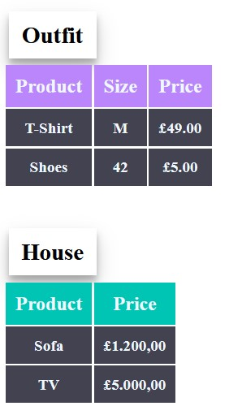

# Exercise 4 - HTML + CSS Basic 💻

## DEV QUEST - Challenge HTML + CSS Basic
This is the final exercise to complete the HTML + CSS Basic Module on the Dev Quest course.

On this module, we have seen the first steps in order to become a frontend Developer, such as, Titles and Paragraphs, Lists, Tables, and how to customize them using CSS.

[]
## Tech used

-
        
-